# Limit Order Book and Market Simulation Project Log

## Aim

To build a simulated market populated by zero-intelligence (ZI) traders using a continuous double auction, where multiple buyers and sellers submit competing bids and asks simultaneously and trades happen continuously when bids and asks match, and investigate the properties of the markets which emerges.

## Architecure

### Order 
Orders are created with a price, a count (number of shares being offered/requested), an order ID, a boolean property "bid" which is True for bids and False for asks, and a "tif" - a time in force, and an expiry time (expiry time and tif are related). For initial setup and testing, I will treat all orders as having an infinite expiry time i.e. they don't expire.

### Limit Order Book
Made up of two `defaultdicts` (one for bids and one for asks), where each key is the price of a bid or ask, made up of `deques` (double ended queues) of the `Order` objects. It also contains two lists - a list of bid prices and ask prices, I used the Sorted Containers library's `SortedLists` for these, this is so I can easily find the highest bid and the lowest ask to check incoming orders against. It also contains a list of order IDs present in the book, so I can keep track of whether an order has been added or not, as well as which orders are present in the book. 

### Matching Logic/Engine
There are two essentially identical methods within the `LimitOrderBook` class, one for matching incoming asks and one for matching incoming bids. They work very similarly, as you would expect. When an order comes in the `process_order` method would be called which simply identifies whether the incoming order is a bid or an ask, it then calls the `match_and_add_bid` or `match_and_add_ask` method for that order, respectively. I will describe the `match_and_add_bid` method here.

Since an order may be big enough to match with and clear out more than one order, the method runs on a while loop which checks that the order count is > 0, i.e. there are still shares's left to bother checking as well as checking whether the order's ID is not already in the list of order IDs in the LOB, in which case it has already been added and we know no more matching can occur. First, the method checks if there are even any asks in the dictionary at all to check against, if not the order is simply added, using the `add_bid` method which handles setting the order ID using the LOB's current `next_id` amd then adding this ID to the ID list, and that is that. 

If there are > 0 asks to be checked against and the bid is greater than the best ask, the difference between the number of counts on the incoming order and of the existing order (this is defined as the first entry, [0] index, of the dictionary of asks of the key of the price which is the [0] index, the lowest ask, in the `SortedList` of asks, or more simply the oldest best ask) is checked (no. incoming order - no.existing order). If this difference is > 0, it means we have a higher count in the incoming bid than the existing ask, and so the existing ask order will get entirely used up by  this incoming order, we must also remove this ask order from the dictionary (not necessarily the entire key, just that order in the `deque`). Since there are counts left in this order, it will not yet be added to the book and go around again, checking whether there is another ask at a lower price than it is bidding and doing the same again. Until either the order is fully used up, in which case it is disgarded and never enters the book, or until there are no more asks present in the book which it crosses with, in this case the order is added to the book itself. The `match_and_add_ask` method is very simply but inverted in every way you would expect.

### Agents
The plan is to populate the simulation with zero-intelligence traders, as discussed in "Allocative Efficiency of Markets with Zero-Intelligence Traders: Market as a Partial Substitute for Individual Rationality" by Gode and Sunder (1993). This paper essentially suggests that even with wholly irrational traders, the market on a whole will still behave with high levels of allocative efficiency. That is, any non-rationality of the traders does not necessarily carry over to the outcome of markets. 

They will initially be subject to no constraints and will just post either bids or asks with a random deviation from some (again, initially) arbitrary "fair price" of the stock. I intend to introduce constraints such as the agents having limited supplies of cash, there being limited shares available, different personalities of agents (such as an aggressive one, a market maker, a preference for long/shorts, a reluctance to trade when their personal supply of cash is low etc.), a stock with supply storage constraints, such as wheat, where the agents may consider how much they can hold at once etc. 

#### Fair price
The fair price will be defined initially by some value, and then once a trade is executed, it will be the most recently traded price.

## Questions and ideas
- maybe have fair price attached to some randomly moving value itself, representing the actual fair price of this thing in the real world or something
- consider fair price being the average of the current best bids and asks in the order book
-   

## Plan
github, running of simulation (e.g. time steps etc.), and ZI traders.

## 24 August 2026
Set up the run file and confirmed simple runs with standard agents generating orders around £100 all with a standard deviation of £5, orders created with quantities from 100 to 1000 inclusive at 100 intervals. 
#### 18:08 - confirmed this is working nicely
Also realised an error here, an agent could feasibly have its own buy order matched with its own sell order, this is something that will need to be considered in the future, note that it would be pretty simple to have the order have an attribute which just recorded the ID of the issuing agent, and just before trades were matched in the LOB, the agent IDs of the orders would be checked, but what happens if they do match? cancel both trades? or leave the existing one in the book and continue to the next (first check price level, then time) with the incoming order.

TO DO: create `Trade` object whcih records the price a trade happened at (will this be price resting in the book, price of incoming order? an average of the two?), the timestamp it occured at, and the quantity traded, as well as maybe agent IDs and order IDs for future when agents have limited stock + cash etc.

## 25 August 2026
Working on implementing th `Trade` object to hold the discussed information. Just realised that if an incoming order matches with more than just 1 existing order, which is completely possible + common, which trade is relevant in terms of the time-series graph, maybe the most recent? note: VWAP (volume weighted average price)

Initial runs, with a fair price of £100, with all agents placing trades based off this, produced a time-series as expected
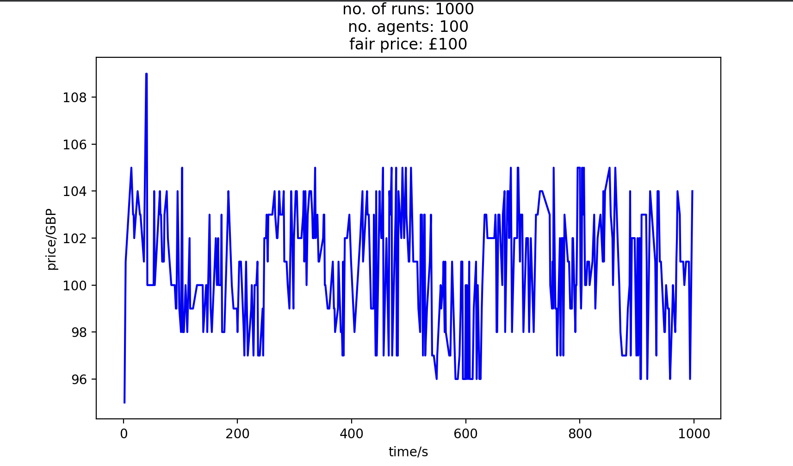

In order to deal w multiple trades per timestep, going to switch to plotting event number on x instead of time. This is as shown below.
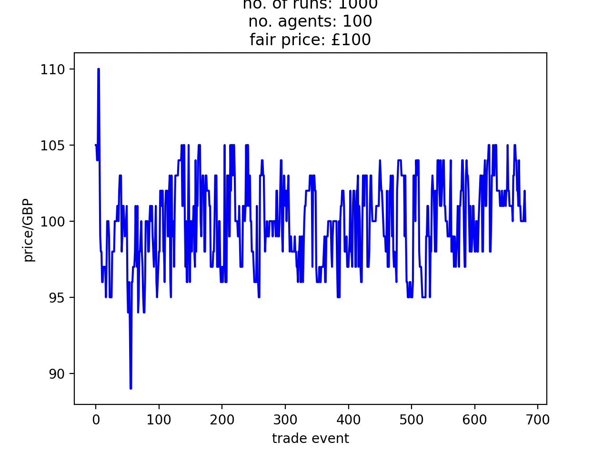

I then made the fair price at each time step equal to the last traded price at the previous time step, this appeared to lead to a random walk pattern. I thought I was noticing the price tend to some value each time and then stop fluctuating, I will need to investigate this further since I see no reason why that should be the case, the following graph shows the price converged to on ten different runs, just to confirm there was variation there, as expected.
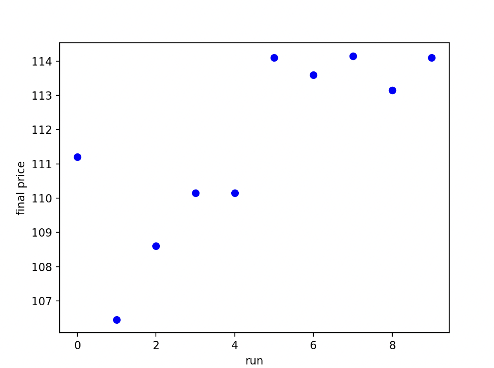

Consider what metrics to actually analyse 1. to confirm simulator behaves like a market or not? 2. to see if I could actually get real useful simulation data here.
Also make simulation + run files cleaner and more compartmentalised TO DO.

## 26 August 2026
Am neatening up code by creating analysis.py file which houses functions to return things like a list of prices, quantities, vwap, returns etc., as well as a plots.py to quickly and neatly plot graphs like time-series etc. Will then move on to actually experimenting with these values, and eventually I must consider making agents ditinguishable, first varying standard deviation of each agent, then a limited cash supply and stuff like that. Then consider a market maker etc.

Created functions for returning prices, quantities etc. VWAPs function is by far the most complex so far, I think I could simplify by just adding the values as I go, maybe in the future consider that (*). Volatility calculations are also considered, later annualised volatility should be considered i.e. taking returns over a time period rather than just between trades.

## 27 August 2026
I have began to set up `analysis.py` and `run.py` files. I want to start off with just confirming that my simulation follows expected behaviour, I am going to consider returns, log returns, volatility (from standard deviation of returns)

### Experiment: returns, log returns, and volatility
Number agents: 100
Number runs: 1000
std dev. agents = £5
Expectation: the log returns will be very similar/identical to the returns, since for small returns there is no difference.
<p align="center">
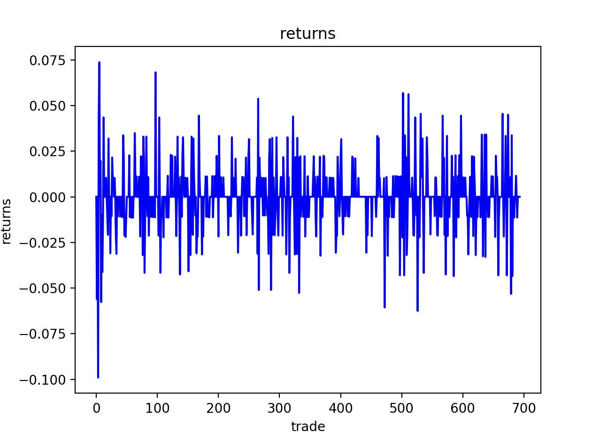
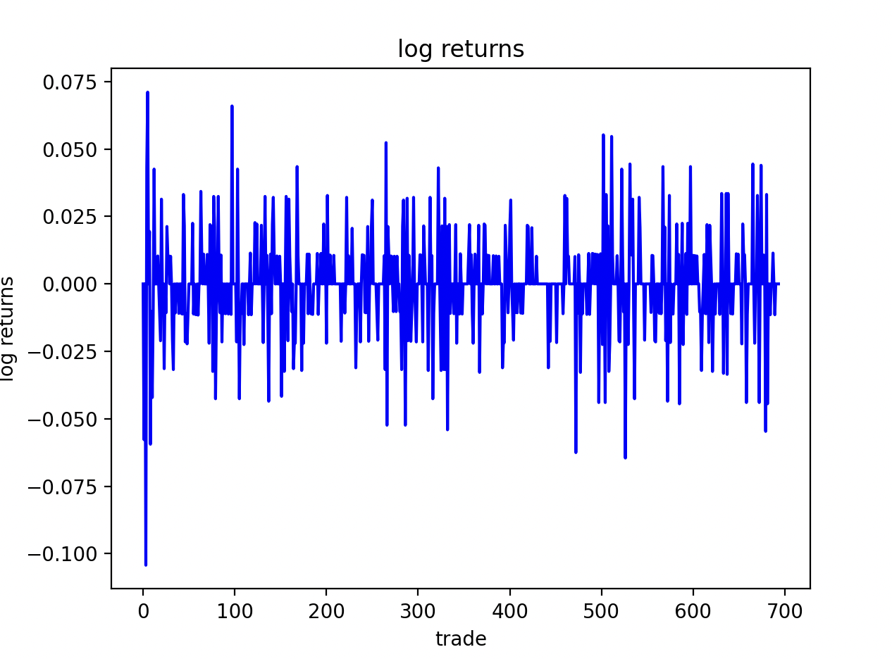
</p>
They are very similar as expected. Volatility is coming out around 0.014-0.019, will test further later on.

### Experiment: Agents' standard deviation effect on volatility
Number agents: 100
Number runs: 1000
Std deviations of agents: 0.5, 1, 1.5, ..., 10
Hypothesis: Increasing standard deviation -> increased volatility. One caveat is that too large standard deviation may lead to spread being too large and few orders crossing the spread.
<p align="center">
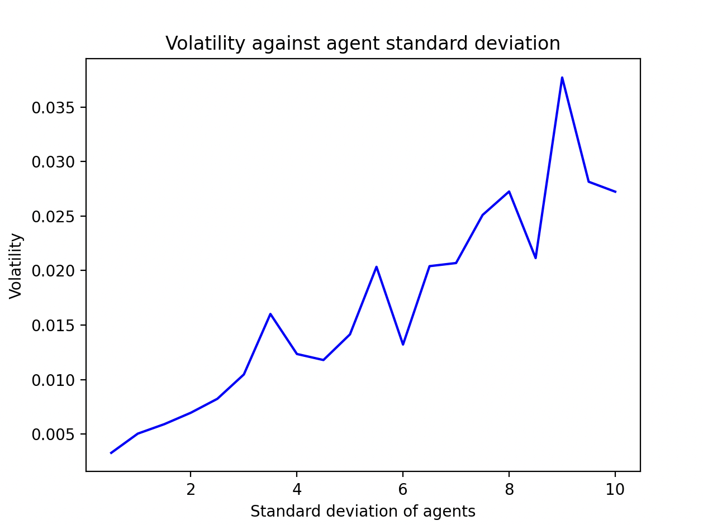
</p>
This is with 100 trials of 1000 steps at each standard deviation, with the volatility averaged over the 100 trials. I am still seeing very jagged lines, even when averaging over such a large number of trials.

Whilst investigating this further, I realised I was creating the simulation once per deviation, and running the same simulation each trial, I changed to creating the simulation inside the trial loop, so each trial for each deviation has its own new simulation now. This seemingly exposed a new error: the price can feasibly drop below 0/can be 0, this should not be possible. This occurs at larger agent std deviations, although I am unsure why it only happened when I created a new simulation each time.

This is where this model appears to break down, I could implement a rejection of order creations by bots if the price sampled ends up less than 0, but I don't think that i very interesting, similarly with truncating the distribution or even something like increasing probability of a positive variance as it gets closer to one std deviation away from 0, at which point the probability must be 1. This ends are zero-intelligence model since that seems like somewhat rational behaviour, albeit based on something very arbitrary - there is no reason a real person would submit a higher order (buy or sell) just because the stocks value is nearing 0.

So now, I will tie agent price decisions to some "fair-value function", the question this project is trying to answer will change from just ZI traders simulating a market to just how much intelligence must these agents have to succesfully simulate properties of real markets. 

I need to think of a fair price function which itself can never go below 0.

I am considering a fair value which is at a fixed price between earnings reports, it then either goes up or down some amount at the earning report, with a HIGHER chance of going up to indicate general growth of companies over time, which makes sense. Later, I may add some tiny chance every time step for a "major" random event to happen, which could lead to fairvalue plumetting or increasing suddenly. But for now, I will consider each timestep to be 1 day, very 90 days, an "earnings report" will be released, this will cause the fundamental value to change. 

To begin with, I will make the changes wholly deterministic i.e. every 90 days, the fair value simply increases by £2, so £100 -> £102 -> £104 etc etc.

### TO-DO tomorrow: 
- Re-write agent code, it is obselete and messy and unsure what it does.
- Test fundamental price mechanics, does the model do as expected?
- When price is below the fair price, all orders submitted by all agents will be bids, and vice-versa, maybe give each agent their own "interpretation" of the fundamental price to allow for the variance and ensure it never gets stuck below, above, or on the fundamental value.

## 28th August 2026
Agent code rewritten such that bids are placed when previous trade price is below the fundamental price and vice versa when previous trade price is above fundamental price. If previous trade price is equal to the fundamental price OR previous trade price is None (no trades yet), a random order either bid or ask is submitted.

This leads to behaviour which seems expected. Sometimes we witness the trade prices successfully matching the fundamental price throughout the evolution, sometimes they appear to fail to take off and we are left with no orders crossing the book, sometimes it takes a while to take off but eventually does. My guess is that it is very dependant upon whether the first trade provides enough depth to the order book to get things started. The case where it eventually gets going I predict is due to a buy order being generated with a large enough deviation from the box muller calculation to cross the book and start the rise up to the book, I still cannot fully understand how this is working so I will do further tests. The three cases are as below.
<p align="center">
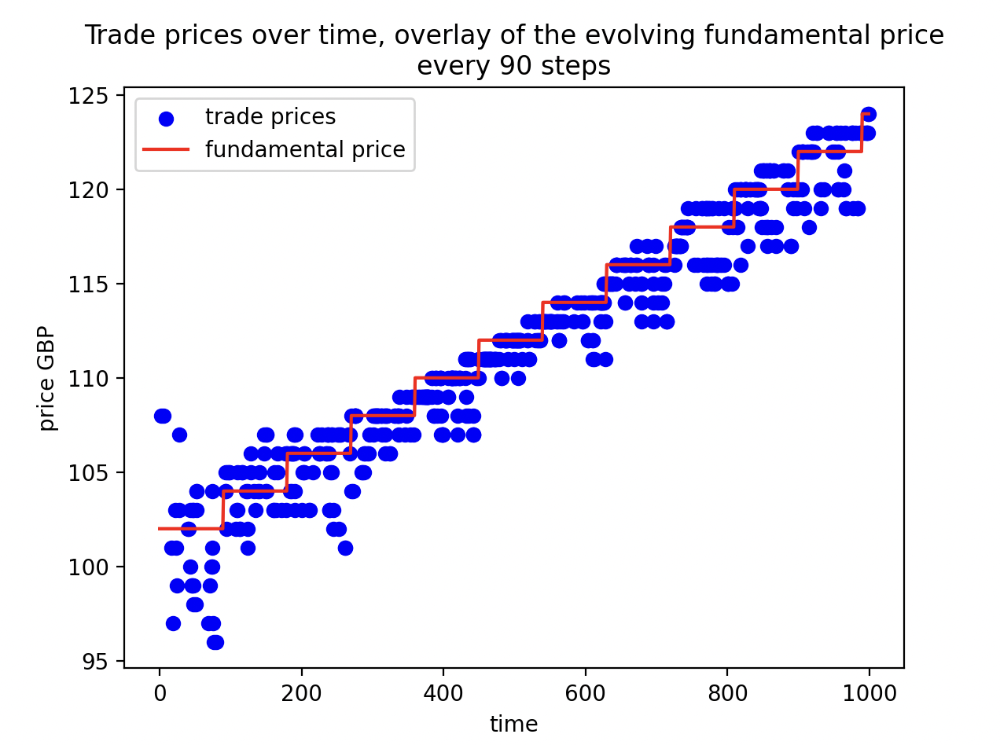
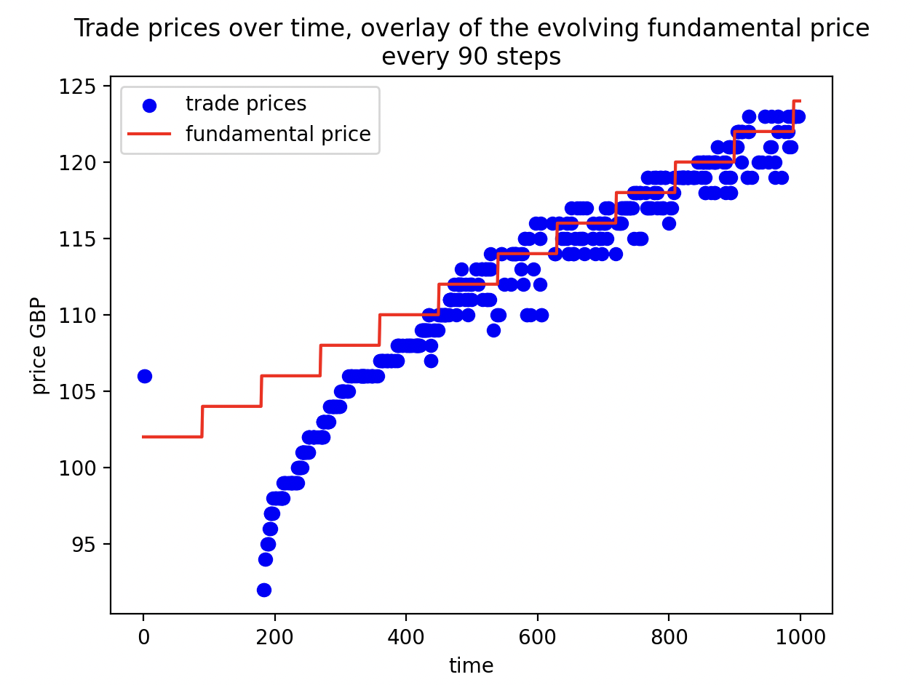
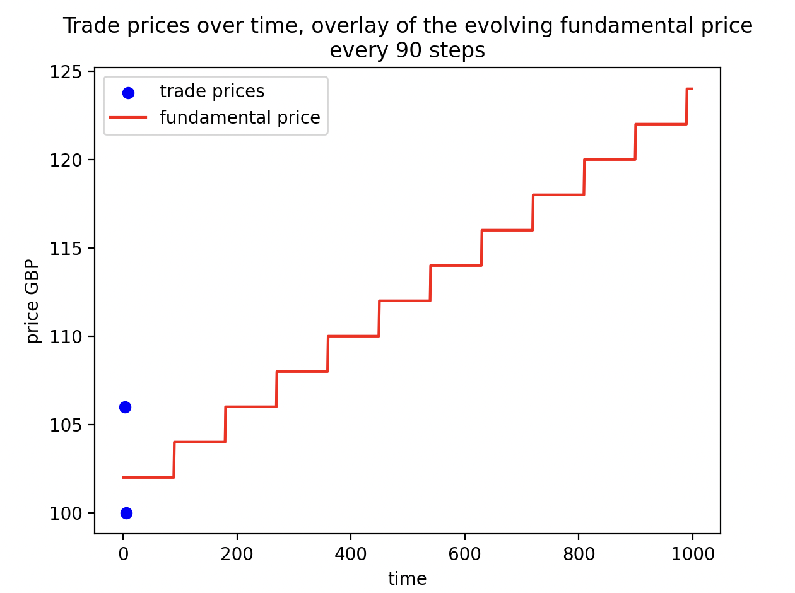
</p>

Upon testing with different standard deviations, I achieved the following results
<p align="center">
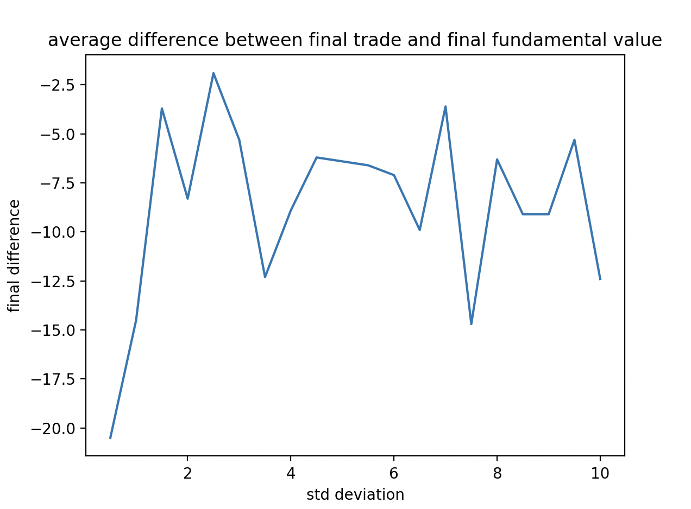
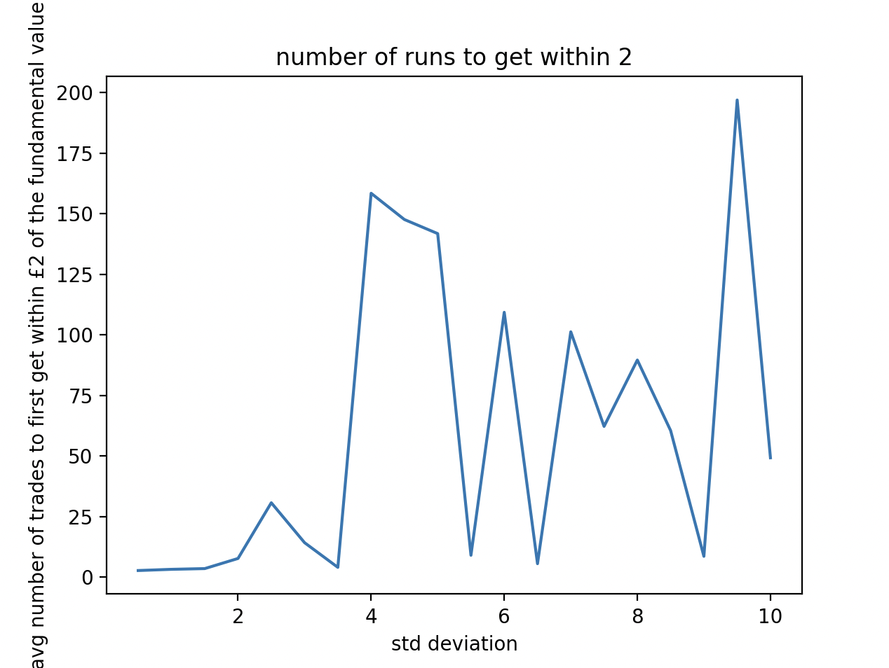
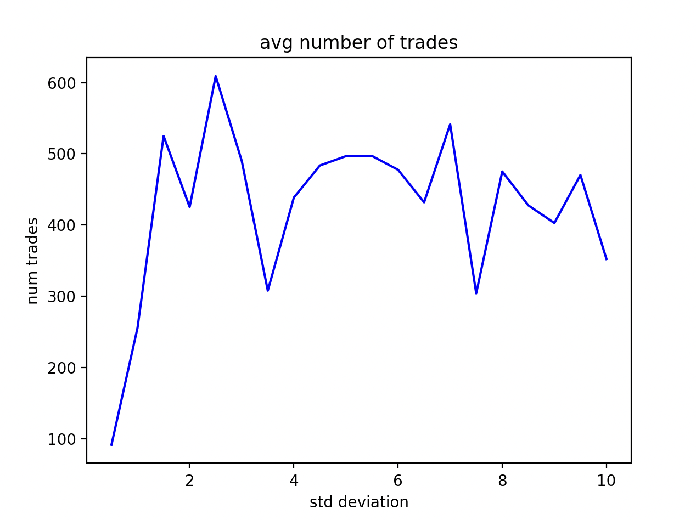
</p>

The average difference graph represents (over 10 runs), the average final difference between the fundamental price and the final trade price. The average time to get within £2 of the fundamental value graph represents the avg number of steps to reach within £2 for the first time, this is slightly skewed toward the lower standard deviations since I am only considering situations where within £2 is reached at all, which is very few out of 10 for the lower standard deviations. So if they are to reach the fundamental value at all, they must do it quickly since it gets much harder as the fundamental value moves upward. And finally, average number of trades simply indicates what it says, it tells us that for the low standard deviations, where fundamental value is rarely reached, the average number of trades is very low and as we go up in standard deviation, we get more trades but not forever, just once we pass about 1.5 - 2, it then remains around 4-500 even for highest std deviations.

### TO-DO 
- Convert prices to pence, slight neatening, test VWAP plots + multiple trades per timestep. Treat each timestep as a day, do a set number of orders per day (could experiment with increasing orders close to certain times e.g. expected earnings reports etc.). 
- Set-up different agents having different interpretations of the fundamental price (experiment with changing deviations size etc.)
- Investigate why simulation appears to slow down more than linearly at higher number of steps

Successfully identified and fixed the error making the simulation slower at larger times (more orders and trades). `self._order_ids` was a list, so in the `while` loop which checked if the order had already been added to the list (i.e. processing was finished), it was O(N), now that it is a `set` instead of a `list`, I am getting approximately linear increase in time as number of runs increases.
```
simulation for 10000 runs took 0.375 seconds
simulation for 20000 runs took 1.403 seconds
simulation for 30000 runs took 2.917 seconds
simulation for 40000 runs took 5.461 seconds
simulation for 50000 runs took 8.517 seconds
simulation for 60000 runs took 11.155 seconds
simulation for 70000 runs took 16.012 seconds
simulation for 80000 runs took 21.298 seconds
simulation for 90000 runs took 27.512 seconds
simulation for 100000 runs took 33.885 seconds
```
TO 
```
simulation for 10000 runs took 0.062 seconds
simulation for 20000 runs took 0.075 seconds
simulation for 30000 runs took 0.115 seconds
simulation for 40000 runs took 0.152 seconds
simulation for 50000 runs took 0.192 seconds
simulation for 60000 runs took 0.237 seconds
simulation for 70000 runs took 0.267 seconds
simulation for 80000 runs took 0.311 seconds
simulation for 90000 runs took 0.356 seconds
simulation for 100000 runs took 0.390 seconds
```
This is a remarkable increase. In the future, once trades are processed and an order is totally removed from the book again, I may then remove the order if that speeds up, the act of removing may in fact be slower than just leaving it so I shall see.

Tomorrow, introduce agents having different "interpretations" of the fundamental value based again off some normal distribution, this should mean the fundamental price is "found" much more consistently.
<p align="center">
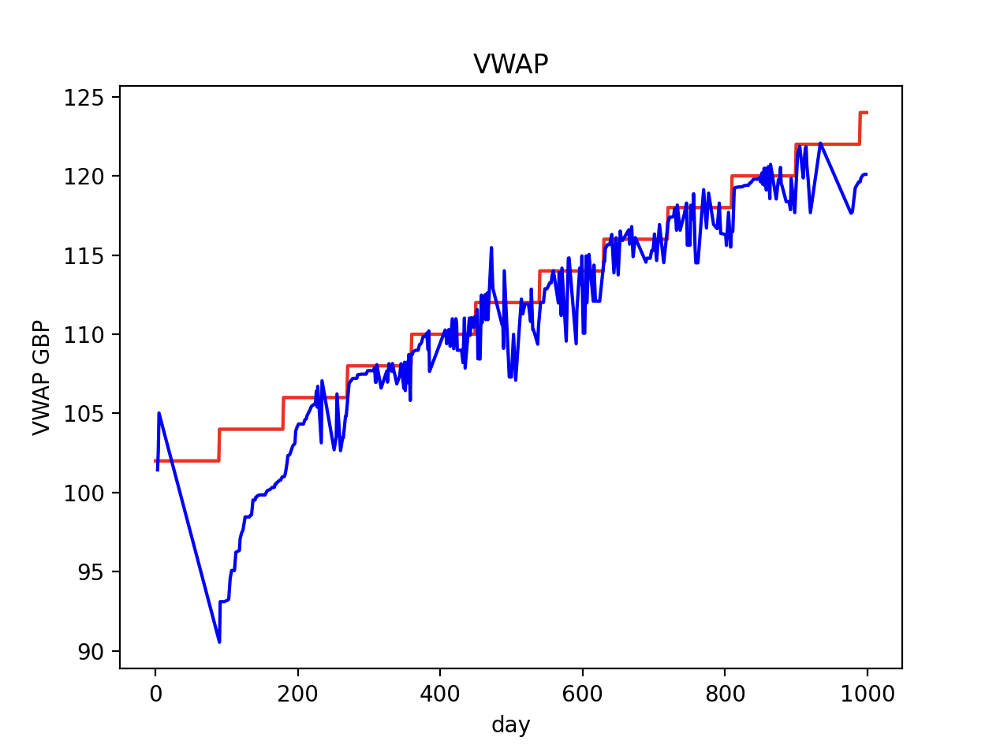
</p>
VWAP for each day plot.

In order to actually get stuff I can put on the CV, I need to get some quantifiable things. So one thing will be the general ability of the simulated market to "discover" the fundamental price, measuring things like difference between VWAP and fundamental value, volatility of this error, proportion of simulations that converge, number of trades/liquidity. This has essentially already been considered but just more formally. 

And the main question can be something like does order book imbalance predict the direction of the next price movement? Can calculate the ratio 
I = (V_bids - V_asks)/(V_bids + V_asks)
Does this being large + positive (i.e. much more bid than ask volume in the book, more demand than supply) lead to positive returns (and vice-versa).

I have now set up the following mechanic:
- Each agent has two inherent standard deviations: the standard deviation applied to each order's price, and the standard deviation applied to the fundamental price to get its perceived fundamental price.
- The agent decides upon a buy or sell order by comparing the previous price to its perceived fundamental price (previous price < perceived fundamental price -> buy order and vice versa)
- The order price is decided by applying the agent's standard deviation for order prices to the perceived fundamental price.

Investigating the MAD, the mean absolute deviation from the fundamental price from each trade resulted in the following graph.
<p align="center">
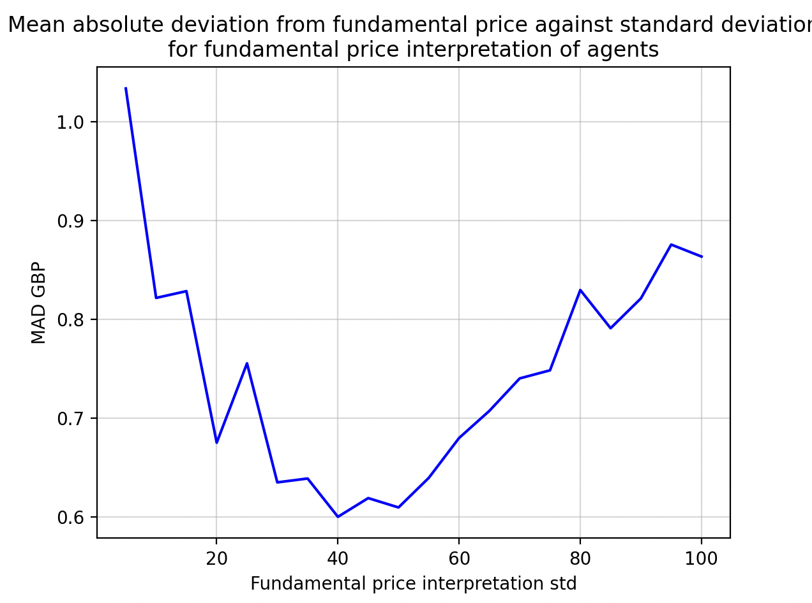
</p>
With fundamental price std in pence. This was for a fundamental price which increased every 90 steps by £2 (100->102->104..). I think the high MAD at low fp std is due to many runs not actually "finding" the fundamental price at all since it is gradually moving away and so they are unable to get a good price around the previous price and so trades dry up, every agent is buying because they still all believe they are below the fundamental price. I will now consider a constant fundamental price, and see if this changes things.
This produced a graph which was very much what I expected, as fp std increases, so does mean deviation from the fundamental price.
<p align="center">
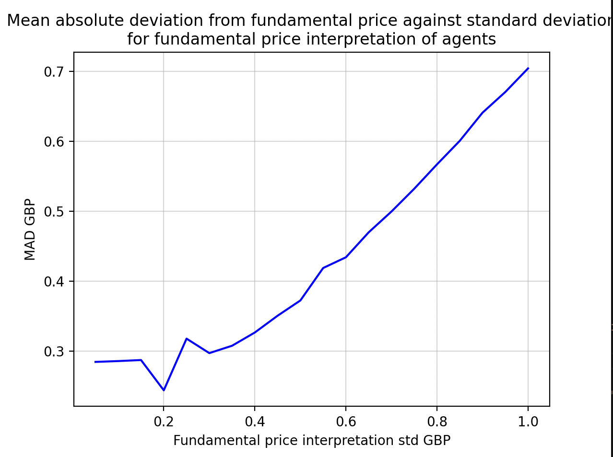
</p>
I will now investigate average number of trades alongside MAD with increasing fp again, to confirm whether higher MAD at lower std for being due to lower trades makes sense.
<p align="center">
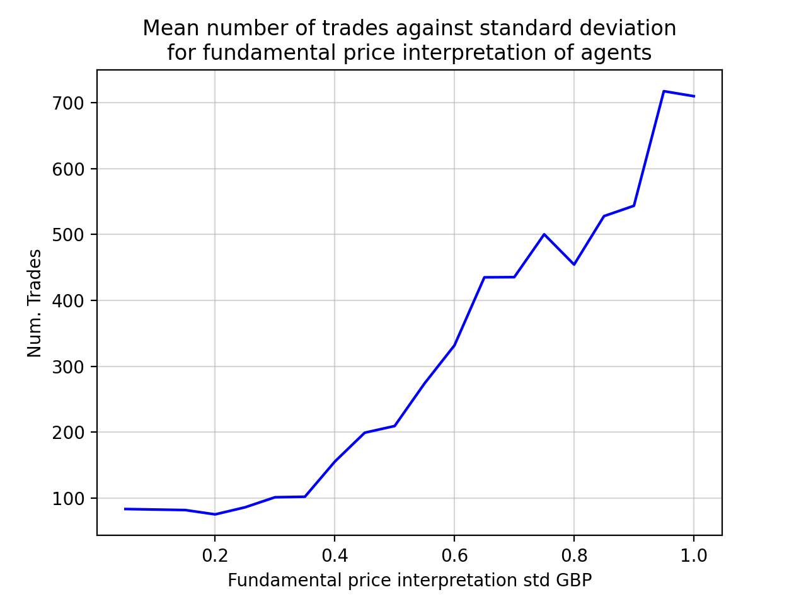
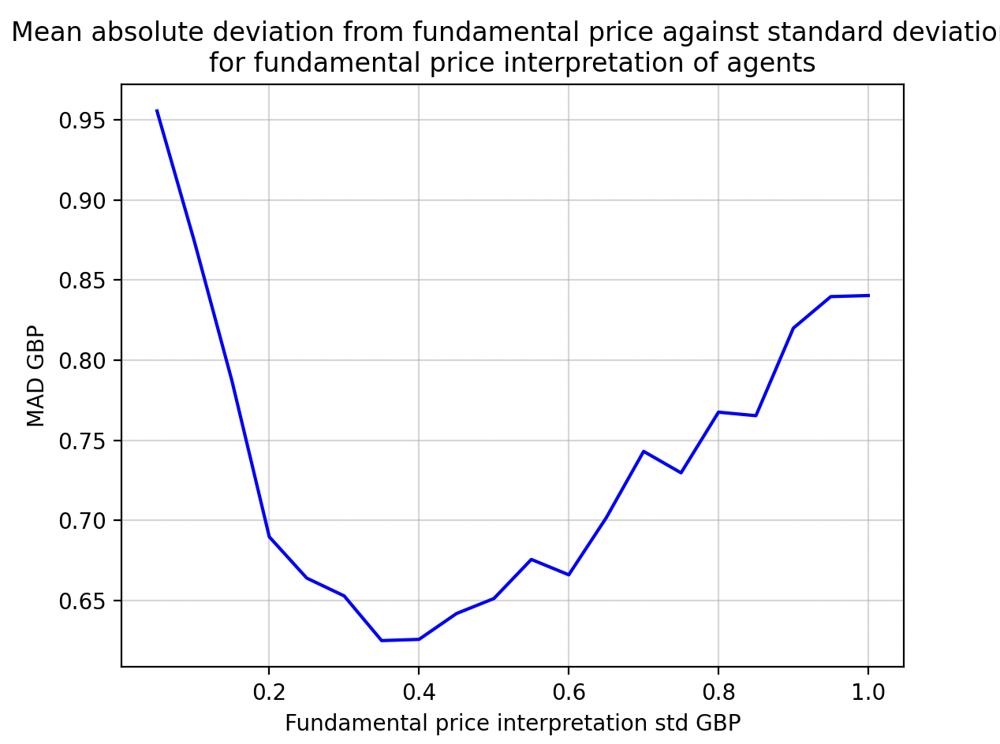
</p>
This very nicely matches my expectations and confirms my hypothesis. Note: agent standard deviation for order prices was kept at £0.50 this entire time, only fundamental price interpretation std was varied. Finally, I obtained results for the average number of trades per fundamental price regime for different std deviations, this showed a much large number of trades at lower std with steep drop offs as we get into higher fundamental price, with higher std seeing shallower drop-offs.

## September 4th 2026
I intend to consider how the volume of each side of the order book effects the future returns of the stock. I want to consider the imbalance every maybe 5 or so timesteps by calculating the ratio 
$$
I = \frac{(V_B - V_A)}{(V_A + V_B)},\quad|I| ≤ 1
$$
This is a measure of the imbalance in the order book. When it is large and positive, we know that we have an imbalance on the bids side of the book, i.e. more bids than asks are sitting in the book and vice-versa for a large negative $I$. This leads us to the hypothesis we are testing of whether order book imbalance is related to short-term returns, with a stronger relationship at larger $|I|$. We will investigate how the future returns move over the following couple of timesteps after our snapshot is taken. We would predict in a normal market that an increased bid volume may lead to short term positive returns, and vice-versa for an increased ask volume, I got this idea as a slight adaptation from Cont Et al. in *The Price Impact of Order Book Events* in 2014 where they discuss order flow imbalance and how that affects short-term returns. Here I am looking more at the static state of the order book. We want to find out whether this holds true for our simulation, whether the simulation recreates this environment despite zero-intelligence agents.

Important question of whether I take the entire book of orders for each side, or only, say, the top 5 levels, or the top 10%, or something. Since I wonder whether old bids which never got filled from when the price was much lower may just sit there, adding false volume to the bid side. And for returns, I will consider the midpoint between the best ask and the best bid, rather than just taking the recently traded price or anything like that.

General concepts:
- every n timesteps, get the ask and bid volumes, the midprice, and the timestamp itself (or the value of n, either) and calculate the imbalance $I$. 
- Every timestep, calculate the midprice of the book, the midpoint of the spread. 
- After simulation is finished, calculate the returns (or log returns) from the timesteps where imbalances are taken from (every n). Initially consider the returns from the midprice at snapshot times $t = an, \, a \in \mathbb{Z}^+,$ and the midprice at horizon h = 5 timesteps later, experiment with varying the delay, t, to see how far into the future this relationship holds (if at all) in our simulation (h = 1, 2, 5, 10, ...).

## September 8th 2026
Going to finish off the mechanics for implementing imbalance calculations. I will initially consider the volume from the entire bid and ask sides of the order book, this may include "false" volume from old trades which never end up disappearing, so I will later test using only the top few levels of each side of the order book.

Considering the option of weighting each level of the order book using linear or exponential decay for each level and seeing which more accurately (if at all) indicates future returns. 

So, for the imbalance counter and the delays, I will do every n timesteps -> calculate imbalance -> record timestep h timesteps into the future, t_i + h, where t_i is the current timestep along with the imbalance at that timestep, the timestep and the midprice -> once we hit t = t_i + h, calculate return using current midprice at t and append (return, imbalance) to a list as a tuple.

I have now implemented everything I need. I will first consider everything fixed aside from the N_levels, the number of levels of the order book (from the best ask/bid down), I will then see which values of N_levels do the best job of predicting the future returns over a fixed horizon. Based off this "best N_levels", I will find which horizons it is best at predicting over IF ANY. I want some sort of quantitative results so I will do maybe a pearson's correlation test or Sharpe ratio or something along those lines. MAYBE, if time, consider weighting the levels (linear vs exponential $w_i = e^{-\lambda(i-1)}$ s.t. $w_1 = 1, w_2 = e^{-\lambda}, w_3 = e^{-2\lambda}$). 

In implementing the tests for the imbalance-return relation, I found that it was difficult to get working because the fundamental price always rose, there were lots of bids in the book and essentially always 0 asks as there was always a bid to match with the incoming asks. Because of this, I will edit my fundamental price to be able to drop, hopefully this will allow midprice calculations to actually work.

I have discovered another issue, I was doing separate simulations for each N, in fact each N should be done off the same simulation since changing N does not change the simulation at all, it just changes our readings of the same data. So I need to change the implementation to collect all levels I want to consider (e.g. 1-10) off the same simulation, this makes a lot of sense otherwise I am comparing across totally different simulations with vastly different random price trajectories since the simulation is inherently stochastic.

<p align="center">
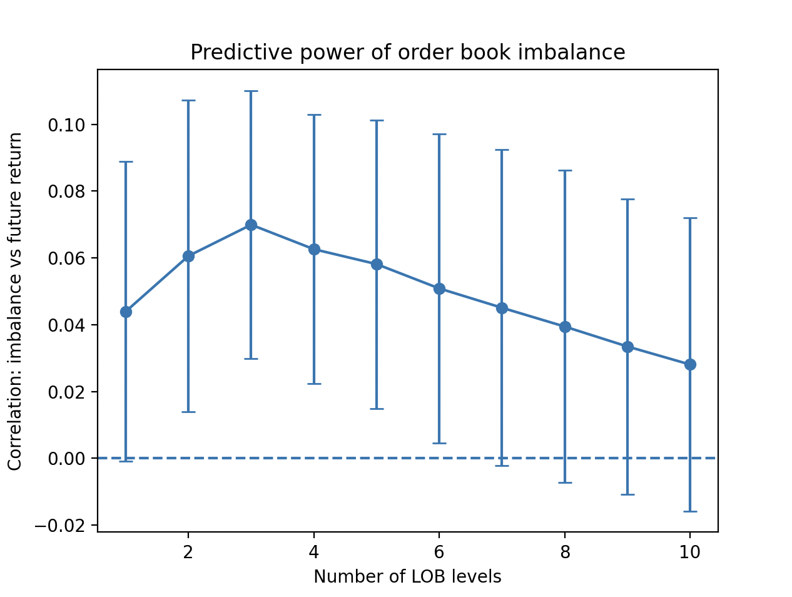
</p>

So this pretty clearly shows us that N = 3 at a mean correlation of 0.066 is the optimal depth to analyse when looking at order book imbalance's effect on returns over a fixed horizon of 10 timesteps, sampled every 10 steps. Now I need to find out the optimal horizon to look over for a fixed N = 3. This will give me the optimal pairing to attempt to get a Sharpe ratio for and finish this off. 

## September 9th 2026
The results indiciate predictive power is strongest at lower horizons, with h = 5 being the peak of our graph here. I will repeat the experiment zoomed into these lower horizons to find the optimal value. This was at a sampling interval s = 10 and depth of order book consideration of N = 3. The simulation was repeated 15 times, and the average correlation of imbalance and log returns was recorded for each horizon. Note that there may be other combinations of N and h which produce good correlation as well, since I just considered each with the other constant, could have considered all combinations (h = 1,N = 1), (1,2),.. etc. etc., others may have got similarly good results.
<p align="center">
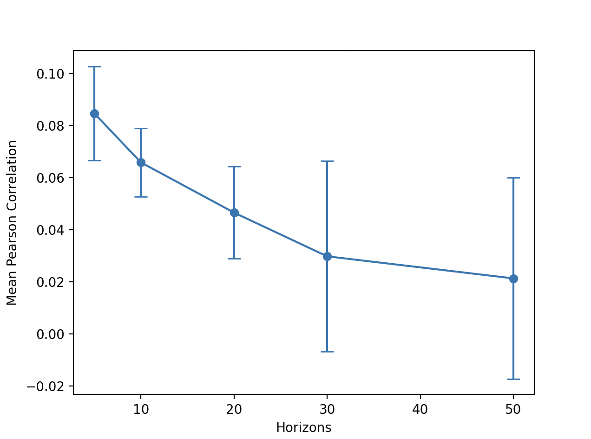
</p>


Now, we can see there is a clear peak at h = 2 timesteps. I am going to investigate the range 1 through 10 more clearly. For this, I will reduce my sampling interval to be every timestep, s = 1.
<p align="center">

</p>

This clearly indicates that horizon = 2 is the ideal parameter. So now I will consider Sharpe ratio using the optimised number of levels = 3 and horizon = 2 on entirely new, out of sample data (since each time I run the simulation, the data is completely fresh). Whilst this is returning relatively small correlations even at the peak of around 0.11, I will see how the Sharpe goes. 

I will be considering the Sharpe over a period, rather than any sort of annualised Sharpe since it is not fully defined what each timestep is. 

I achieved an initial Sharpe of 0.08869925978309587, which is not great and may suggest the simulation does not recreate the environment needed to produce meaningful returns from this strategy. I will compare it to a strategy made up of random positions. This ultimately provided me with a Sharpe ratio from the strategy (on a new run) of 0.090 (2sf) and from a random strategy taking random positions over the same horizon = 2, achieved a Sharpe of 0.00063 (2sf). This very strongly demonstrates that the simulation does develop a weak but non-random relationship between order-book imbalance and subsequent price movements. This was over 15 runs at 100,000 steps per run, resulting in around 511k total observations.

I noticed as I was cleaning up my code that there was a slight sensitivity to order size in the Sharpe ratio. I had it arbitrarily at 100 to 1,000 in increments of 100 to begin with, and never thought to change it. I altered it from to 1,000 to 10,000, still at increments of 100, and found that it did produce a modest increase in the Sharpe to a consistent ~0.1 across multiple runs. I had thought it might have no effect since everything was increasing by the same multiple of 10 but I realised that since the increment was remaining constant, there were now a lot more values the orders could take, this could lead to less chance the order gets fully used up and maybe slightly more liquidity in the order book. I have left it at 1,000 to 10,000 with 100 increments since having only 10 order quantity options was very small and arbitrary, 100 seems more realistic.

My final Sharpe for the strategy vs. the random control is as follows:

```
Sharpe for the strategy is 0.09939335309979493

Sharpe for random control strategy is -0.0010761873845797439

Mean returns is 0.00011637126892824994

Standard deviation of returns is 0.001170815404641883

Total observations is 1271510
```

This is for the a horizon and sampling interval of 2 steps and an included order book depth of 3 for calculating imbalance. This is 30 simulations of 100,000 runs. This is a per period Sharpe, rather than annualised since there is no definition of what the simulation timestep actually represents, e.g. if these two steps represent a day, the annualised Sharpe would be $~0.1 \times \sqrt{250} \approx 1.58$ but if each steps were a second, it would be around ~170 annualised Sharpe, which is ridiculous. So we must only consider per period Sharpe. 

