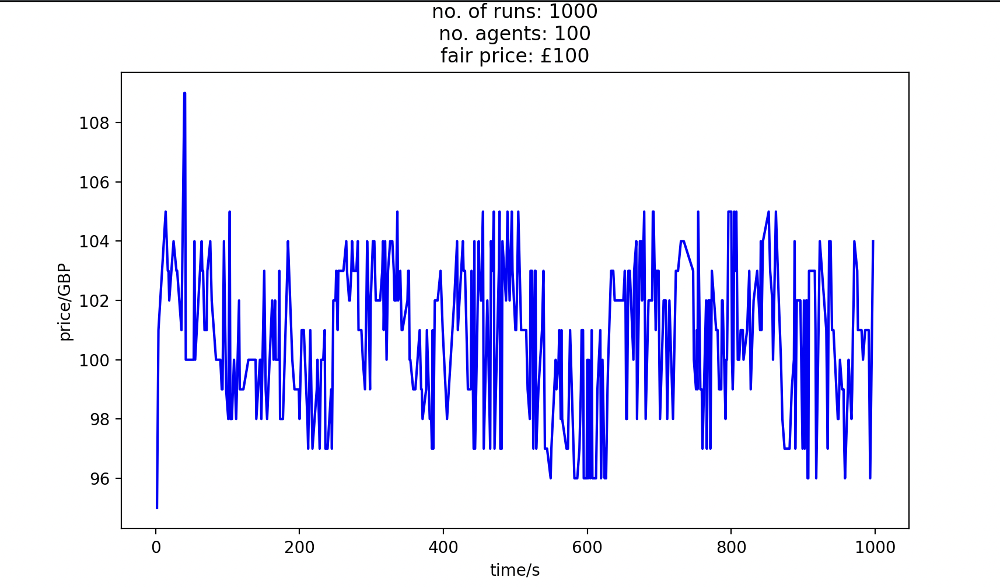
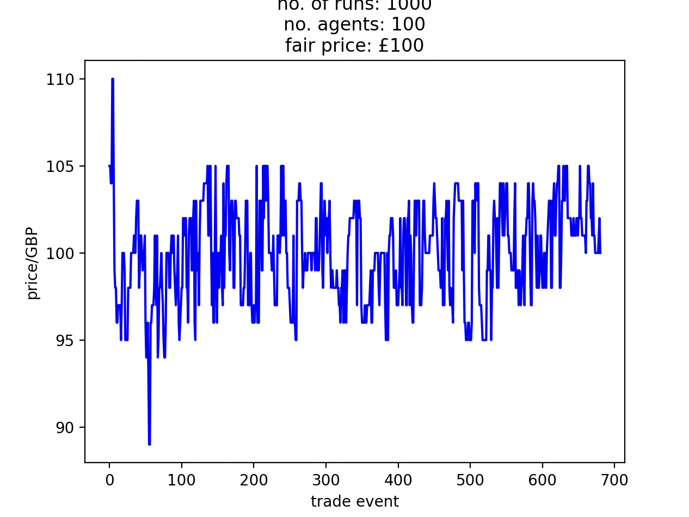

# Limit Order Book and Market Simulation Project Log

## Aim

To build a simulated market populated by zero-intelligence (ZI) traders using a continuous double auction, where multiple buyers and sellers submit competing bids and asks simultaneously and trades happen continuously when bids and asks match, and investigate the properties of the markets which emerges.

## Architecure

### Order 
Orders are created with a price, a count (number of shares being offered/requested), an order ID, a boolean property "bid" which is True for bids and False for asks, and a "tif" - a time in force, and an expiry time (expiry time and tif are related). For initial setup and testing, I will treat all orders as having an infinite expiry time i.e. they don't expire.

### Limit Order Book
Made up of two `defaultdicts` (one for bids and one for asks), where each key is the price of a bid or ask, made up of `deques` (double ended queues) of the `Order` objects. It also contains two lists - a list of bid prices and ask prices, I used the Sorted Containers library's `SortedLists` for these, this is so I can easily find the highest bid and the lowest ask to check incoming orders against. It also contains a list of order IDs present in the book, so I can keep track of whether an order has been added or not, as well as which orders are present in the book. 

### Matching Logic/Engine
There are two essentially identical methods within the `LimitOrderBook` class, one for matching incoming asks and one for matching incoming bids. They work very similarly, as you would expect. When an order comes in the `process_order` method would be called which simply identifies whether the incoming order is a bid or an ask, it then calls the `match_and_add_bid` or `match_and_add_ask` method for that order, respectively. I will describe the `match_and_add_bid` method here.

Since an order may be big enough to match with and clear out more than one order, the method runs on a while loop which checks that the order count is > 0, i.e. there are still shares's left to bother checking as well as checking whether the order's ID is not already in the list of order IDs in the LOB, in which case it has already been added and we know no more matching can occur. First, the method checks if there are even any asks in the dictionary at all to check against, if not the order is simply added, using the `add_bid` method which handles setting the order ID using the LOB's current `next_id` amd then adding this ID to the ID list, and that is that. 

If there are > 0 asks to be checked against and the bid is greater than the best ask, the difference between the number of counts on the incoming order and of the existing order (this is defined as the first entry, [0] index, of the dictionary of asks of the key of the price which is the [0] index, the lowest ask, in the `SortedList` of asks, or more simply the oldest best ask) is checked (no. incoming order - no.existing order). If this difference is > 0, it means we have a higher count in the incoming bid than the existing ask, and so the existing ask order will get entirely used up by  this incoming order, we must also remove this ask order from the dictionary (not necessarily the entire key, just that order in the `deque`). Since there are counts left in this order, it will not yet be added to the book and go around again, checking whether there is another ask at a lower price than it is bidding and doing the same again. Until either the order is fully used up, in which case it is disgarded and never enters the book, or until there are no more asks present in the book which it crosses with, in this case the order is added to the book itself. The `match_and_add_ask` method is very simply but inverted in every way you would expect.

### Agents
The plan is to populate the simulation with zero-intelligence traders, as discussed in "Allocative Efficiency of Markets with Zero-Intelligence Traders: Market as a Partial Substitute for Individual Rationality" by Gode and Sunder (1993). This paper essentially suggests that even with wholly irrational traders, the market on a whole will still behave with high levels of allocative efficiency. That is, any non-rationality of the traders does not necessarily carry over to the outcome of markets. 

They will initially be subject to no constraints and will just post either bids or asks with a random deviation from some (again, initially) arbitrary "fair price" of the stock. I intend to introduce constraints such as the agents having limited supplies of cash, there being limited shares available, different personalities of agents (such as an aggressive one, a market maker, a preference for long/shorts, a reluctance to trade when their personal supply of cash is low etc.), a stock with supply storage constraints, such as wheat, where the agents may consider how much they can hold at once etc. 

#### Fair price
The fair price will be defined initially by some value, and then once a trade is executed, it will be the most recently traded price.

## Questions and ideas
- maybe have fair price attached to some randomly moving value itself, representing the actual fair price of this thing in the real world or something
- consider fair price being the average of the current best bids and asks in the order book
-   

## Plan
github, running of simulation (e.g. time steps etc.), and ZI traders.

## 24 August 2026
Set up the run file and confirmed simple runs with standard agents generating orders around £100 all with a standard deviation of £5, orders created with quantities from 100 to 1000 inclusive at 100 intervals. 
#### 18:08 - confirmed this is working nicely
Also realised an error here, an agent could feasibly have its own buy order matched with its own sell order, this is something that will need to be considered in the future, note that it would be pretty simple to have the order have an attribute which just recorded the ID of the issuing agent, and just before trades were matched in the LOB, the agent IDs of the orders would be checked, but what happens if they do match? cancel both trades? or leave the existing one in the book and continue to the next (first check price level, then time) with the incoming order.

TO DO: create `Trade` object whcih records the price a trade happened at (will this be price resting in the book, price of incoming order? an average of the two?), the timestamp it occured at, and the quantity traded, as well as maybe agent IDs and order IDs for future when agents have limited stock + cash etc.

## 25 August 2026
Working on implementing th `Trade` object to hold the discussed information. Just realised that if an incoming order matches with more than just 1 existing order, which is completely possible + common, which trade is relevant in terms of the time-series graph, maybe the most recent? note: VWAP (volume weighted average price)

Initial runs, with a fair price of £100, with all agents placing trades based off this, produced a time-series as expected

In order to deal w multiple trades per timestep, going to switch to plotting event number on x instead of time. This is as shown below.

